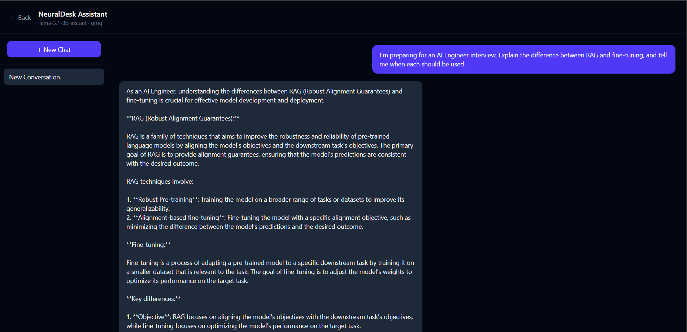
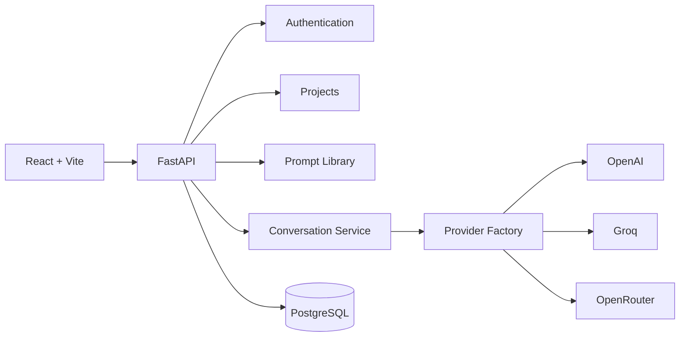

# NeuralDesk

> Build, configure, and deploy multiple AI assistants — each with its own LLM provider, system prompt, and conversation history. Switch between OpenAI, Groq, and OpenRouter without touching application code.


<h3 align="center">
A Production-Ready Multi-Tenant AI Chatbot Platform
</h3>

<p align="center">
Configure AI assistants with custom prompts, multiple LLM providers, streaming conversations, secure authentication, and project-based workspaces.
</p>

<p align="center">


</p>

---

# Live Demo

### Frontend

https://neuraldesk-puce.vercel.app

### Backend API

https://neuraldesk-production.up.railway.app/docs

---

# Application Preview

## Login


---

## Project Dashboard


---

## Create AI Project


---

## AI Conversation




---

# Overview

NeuralDesk is a production-ready SaaS-style AI chatbot platform that allows users to build and manage multiple AI assistants.

Each assistant (Project) maintains its own:

- System Prompt
- LLM Provider
- AI Model
- Temperature
- Prompt Library
- Conversation History

The platform follows a modular architecture where business logic is completely separated from AI providers, allowing projects to switch between OpenAI, Groq, and OpenRouter without modifying the application code.

---

# Features

## Authentication

- JWT Authentication
- Secure Login & Registration
- Password Hashing (bcrypt)
- Protected APIs
- Refresh Token Support

---

## AI Workspace

- Multiple AI Projects
- Configurable System Prompts
- Model Selection
- Temperature Control
- Conversation History
- Prompt Library

---

## Chat Experience

- Streaming AI Responses
- Multiple Conversation Threads
- Markdown Rendering
- Persistent Chats
- Real-Time Response Streaming

---

## AI Providers

- OpenAI
- Groq
- OpenRouter

Switch providers without changing application logic.

---

## Backend

- FastAPI
- SQLAlchemy Async
- Repository Pattern
- Service Layer Architecture
- Dependency Injection
- Async PostgreSQL
- REST APIs

---

## Deployment

- Frontend deployed on Vercel
- Backend deployed on Railway
- PostgreSQL hosted on Neon

---

# Tech Stack

| Layer | Technology |
|---------|------------|
| Frontend | React + TypeScript + Vite |
| Styling | Tailwind CSS |
| State Management | Zustand |
| Backend | FastAPI |
| ORM | SQLAlchemy Async |
| Database | PostgreSQL (Neon) |
| Authentication | JWT + bcrypt |
| AI Providers | OpenAI, Groq, OpenRouter |
| Deployment | Railway + Vercel |

---

# Why Provider Abstraction?

NeuralDesk separates AI providers from business logic using a provider interface.

```
LLM Provider

      │

───────────────

OpenAI

Groq

OpenRouter
```

Every provider implements the same interface.

This allows the application to switch providers by configuration rather than modifying business logic.

During development, OpenAI's free-tier quota was exhausted. The project was migrated to Groq by simply updating the provider configuration—no service-layer changes were required.

---

# System Architecture



---

# Repository Structure

```
neuraldesk/

├── backend/

│ ├── app/

│ │ ├── api/

│ │ ├── core/

│ │ ├── db/

│ │ ├── llm/

│ │ ├── repositories/

│ │ ├── services/

│ │ ├── schemas/

│ │ └── models/

│

├── frontend/

│ ├── src/

│ │ ├── api/

│ │ ├── pages/

│ │ ├── components/

│ │ ├── hooks/

│ │ └── store/

│

├── assets/

│ ├── login.png

│ ├── dashboard.png

│ ├── create-project.png

│ ├── chat.png

│ └── prompts.png

│

├── ARCHITECTURE.md

├── README.md

└── LICENSE
```

---

# Running Locally

## Clone

```bash
git clone https://github.com/kshitisha/neuraldesk.git

cd neuraldesk
```

---

## Backend

```bash
cd backend

python -m venv .venv

source .venv/bin/activate

pip install -r requirements.txt
```

Create a `.env`

```env
DATABASE_URL=

SECRET_KEY=

OPENAI_API_KEY=

GROQ_API_KEY=

OPENROUTER_API_KEY=
```

Run

```bash
python create_tables.py

uvicorn app.main:app --reload
```

Swagger

```
http://localhost:8000/docs
```

---

## Frontend

```bash
cd frontend

npm install

npm run dev
```

Frontend

```
http://localhost:5173
```

---

# API Endpoints

| Method | Endpoint | Description |
|---------|----------|-------------|
| POST | `/auth/register` | Register |
| POST | `/auth/login` | Login |
| GET | `/auth/me` | Current User |
| POST | `/projects` | Create Project |
| GET | `/projects` | List Projects |
| PUT | `/projects/{id}` | Update Project |
| DELETE | `/projects/{id}` | Delete Project |
| POST | `/chat` | Stream Chat |
| POST | `/prompts` | Create Prompt |
| POST | `/files` | Upload Files |

---

# Deployment

## Frontend

Platform

```
Vercel
```

Build Command

```bash
npm run build
```

Output Directory

```
dist
```

---

## Backend

Platform

```
Railway
```

Database

```
Neon PostgreSQL
```

Start Command

```bash
uvicorn app.main:app --host 0.0.0.0 --port $PORT
```

---

# Future Roadmap

- [ ] Redis Caching
- [ ] Vector Database (RAG)
- [ ] Anthropic Claude Support
- [ ] Gemini Support
- [ ] Team Workspaces
- [ ] Role-Based Access Control
- [ ] Analytics Dashboard
- [ ] Docker Support
- [ ] Kubernetes Deployment
- [ ] Rate Limiting
- [ ] Observability & Monitoring

---

# Highlights

- Production-ready FastAPI backend
- Repository-Service Architecture
- Async SQLAlchemy
- JWT Authentication
- Streaming AI Responses
- Multi-Tenant Design
- Provider Abstraction Layer
- PostgreSQL Persistence
- Railway Deployment
- Vercel Deployment

---

# Author

## Kshitisha Negi

AI/ML Engineer

GitHub: https://github.com/kshitisha

LinkedIn: https://www.linkedin.com/in/kshitisha3333/

---

If you found this project interesting, consider giving it a ⭐.
